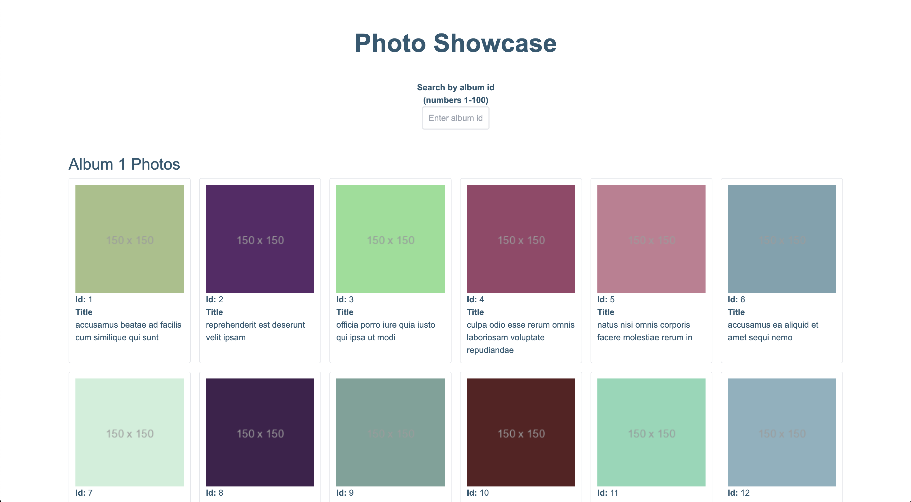
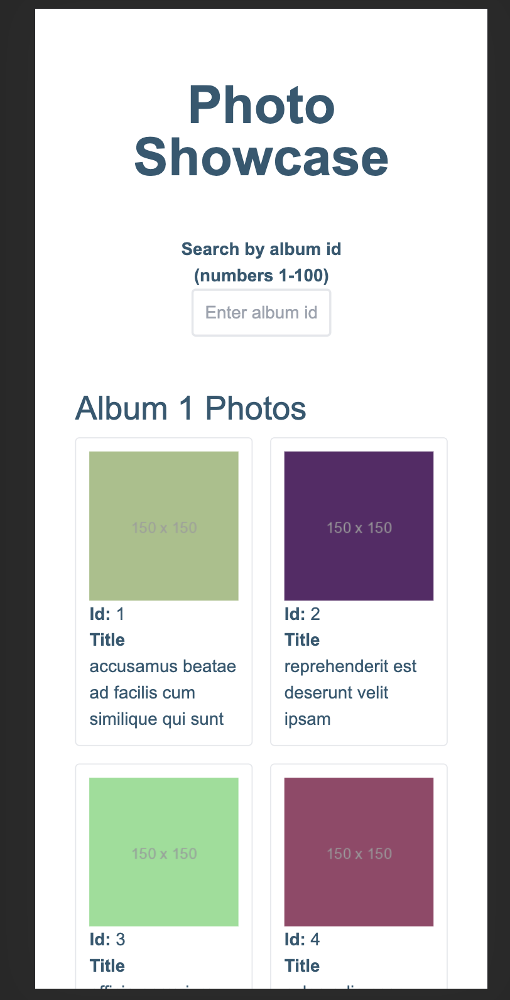
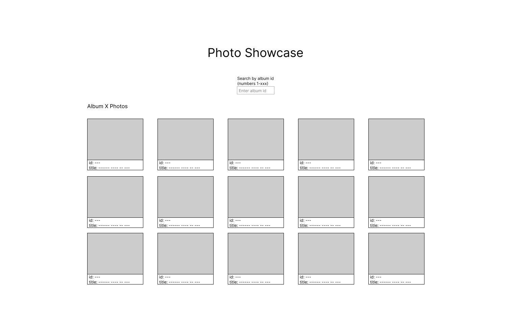
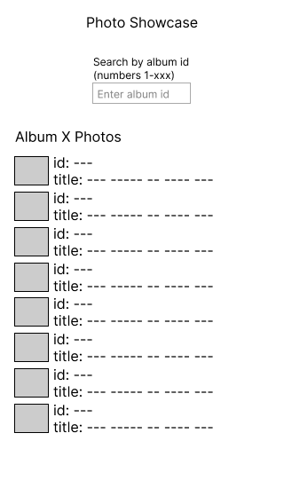
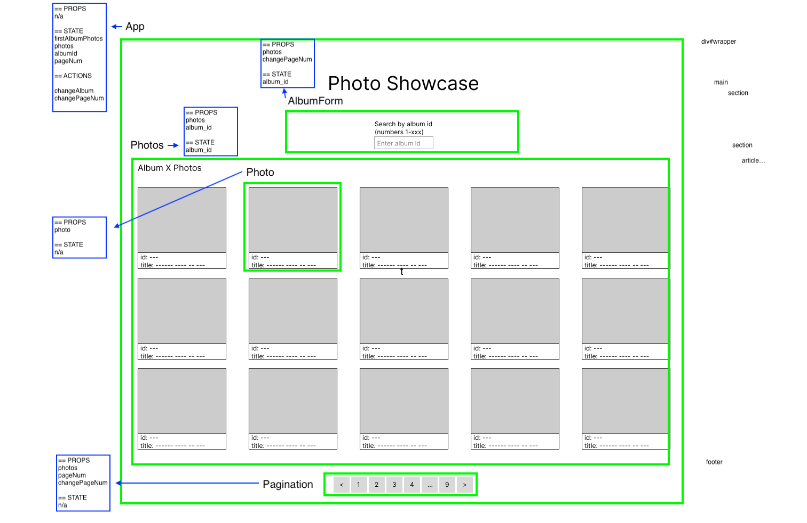

# Photo Showcase

This project is a React application to display and search for photos by a photo album id.

**Note**
A deprecated version of this project using Bun as the JavaScript runtime and test runner can be found here: [photo-showcase](https://github.com/jreich5/photo-showcase).

You can view a live version of the application [here](https://jreich5.github.io/photo-showcase-node/).

[This GitHub project board](https://github.com/users/jreich5/projects/3) was used to organize the development of this application. More details on the project, the development process, and how to run the project locally are included below.

## Table of Contents

- [Description](#description)
- [Setup](#setup)
- [Development Process](#development-process)
- [Lessons Learned](#lessons-learned)

## Description

This showcase demonstrates a React + TypeScript application with using several technologies:

- [Node.js](https://nodejs.org/en) - the runtime environment
- [npm](https://www.npmjs.com/) - dependency management
- [Jest](https://jestjs.io/) - test runner
- [Vite](https://vitejs.dev/) - development server and React configuration
- [Fetch API](https://developer.mozilla.org/en-US/docs/Web/API/Fetch_API) - API calls
- [TailwindCSS](https://tailwindcss.com/) - styling
- [Figma](https://www.figma.com/) - wireframing / mockups
- [GitHub Projects](https://docs.github.com/en/issues/planning-and-tracking-with-projects/learning-about-projects/about-projects) - manage Kanban cards
- [GitHub Pages](https://pages.github.com/) - hosts live site
- [React Testing Library](https://testing-library.com/) - component and integration testing
- [Cypress](https://www.cypress.io/) - end-to-end testing

Notable features:

- test-driven components
- test-driven custom form validation for the album id input
- mobile-responsive design
- photo API data stored in local storage for faster data retrieval and DOM loading
- use of `useMemo` to cache the calculated number of albums
- end-to-end testing using Cypress

## Setup

To run the application locally, complete the following steps:

1. Clone this repository
1. `npm install` - installs dependencies
1. `npm run dev` - starts up dev server and runs project locally

The tests can be run with the following commands:

- `npm run test` - runs all unit and integration tests
- `npm run e2e` - runs E2E tests on the live site

## Development Process

### Inital Setup and Planning

I started started this project by first building out a <10min [prototype](https://github.com/jreich5/photo-showcase/blob/main/ten-minute-prototype.html) in a single HTML file with JavaScript. I did this to get a quick sense of the basic functionality of the project.

After completing the prototype, I decided to build out a front-end app using React+TypeScript with Vite and Bun. My goal with this build was to strike a balance between over-engineering and adhering to as many best practices as possible.

**Note**
I chose Bun as a fun challenge and for the DX. It was incredibly fast but proved too exprimental for Windows. This version uses Node, npm, and Jest.

I prioritized the following considerations:

1. Comprehensive test coverage
1. Code quality
1. Performance

After first setting up the project and removing the boilerplate code, I pushed the starting code up to a new GitHub repository and populated a GitHub Project board with tasks for completing the showcase.

I then created mockups with Figma for the desktop and mobile views.

Desktop mockup:

Mobile mockup:

I then planned out what my component hierarchy would be using annotations in Mac Preview (the version below still contained pagination and a few mislabled props):

After building the components, I focused on adding the the state and props to the components. This lead to creating the API calls for data fetching and optimizing performance using local storage.

With the components built and the data being displayed, I focused on styling with TailwindCSS. Once that was completed, I focused on refactoring the code to use more explicit typing in TypeScript and refactored all my component props to use interfaces.

The final steps of development consisted of adding error handling for my API calls, deploying the live site and adding ent-to-end tests.

### TDD

While not entirely test-driven, I initially built out the React components by first writing component tests and verifying that my components rendered properly. When refactoring my album id input validation, I used TDD to create several small functions to verify if a user's input should change the input state.

### Challenges

In the course of building this project, I encountered several blockers:

- Getting the RTL tests to work on child components (related to API mocking)
- Implementing pagination
- Spotting a bug in production
- Pivoting away from Bun

It took me a bit of tinkering to understand that in order for me to render child components and test them, I needed to teardown the DOM after testing each component. I found that the `afterAll` method in the Bun test runner allowed me to call the `cleanup` method from the React Testing Library.

Pagination was a significant feature I intended to implement but it wasn't part of the the MVP and had to be moved to the backlog due to time contraints.

After deploying to GitHub pages, the data was not rendering. I had not tested clearing out localStorage since a much earlier stage of development and the live site was not loading data due to setting the wrong value for the state of the photos. I was able to debug this issue by throwing in alerts, then console logs while using the `vite preview` and eventually found this issue was also occuring locally.

The transition of the project away from Bun involved updating various configurations in Vite and integrating Jest. While the Bun test runner API is Jest-like, there were some breaking changes in some of the matchers.

### Use of AI

I leveraged ChatGPT at points throughout this project for general questions on how certain technologies interacted with each other. I rarely used any AI-generated code but I did find the code suggestions to be helpful in writing my E2E tests with Cypress.

## Lessons Learned

Building this Showcase was fun and highlighted several areas of continued growth:

### Don't wait to resolve TypeScript types

I allowed the bun:test dependency to stay unresolved for much of the project. If I had compiled my TypeScript code sooner, I would have seen several small refactors I could have done from the beginning.

### Be careful with exceeding MVP scope

The pagination feature should have been de-prioritized sooner in favor of better test coverage.

### Bun is awesome, but cutting edge isn't always worth the risk

Bun is FAST but online examples are harder to find. The experiemental nature of the technology on Windows ultimately lead me to pivot back to Node.js.

### Mocking is tricky

Testing in React applications in general is a new challenge. I spent a fair amount of time attempting to mock the API data coming from my useEffect hook. If I had used Jest from the beginning, the existing resources online would have been more relevant and simpler to implement.

### Feature complexity estimations are very hard to predict

I labeled each planned feature as either "low", "mid" or "high" complexity, based on a combination of my prior experience and prediction of the scope of the feature. I found that I both undershot and overshot complexity for various features throughout the development of this project.
